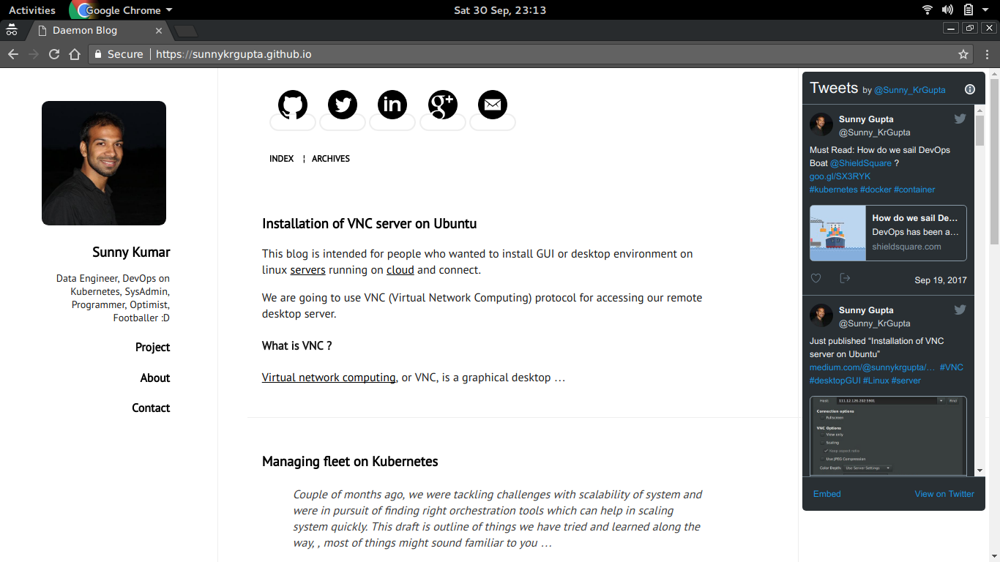

## pelican-svbtle-responsive

pelican-svbtle-responsive is a responsive theme for Pelican. Customized from forks.

## Demo

You can see the [theme in action](https://sunnykrgupta.github.io/).

## Features

- Clean and responsive design
- [Disqus](https://disqus.com/) Comments
- Customizable Syntax highlighting via [pygments][pygments]
- Google analytics
- Twitter Widgets [twitter-cards]
- Navigator for social sites on top : google+, twitter, github, linkedin, email

[Twitter-Widgets]: https://dev.twitter.com/web/embedded-timelines

## Installation

Clone the [repository](https://github.com/sunnykrGupta/pelican-svbhack-responsive), edit your `pelicanconf.py` and modify the `THEME` variable to make it point to the downloaded theme location.

## Configurations

Supports a number of common global variables but patches are welcomed if you need better support.

- `GOOGLE_ANALYTICS` to use Google Analytics, set this var to your UA-XYZ code

- `USER_LOGO_URL` to replace the logo placeholder, put your logo in content/images/your_logo.png and make this var point to `SITEURL + '/static/images/your_logo.png'`

- `DISQUS_SITENAME` set this to your Disqus sitename to enable disqus comments in articles

- `TAGLINE` some text rendered right below the logo

- `INTERNET_DEFENSE_LEAGUE` set this to `True` if you want to enable the [Internet Defense League](http://internetdefenseleague.org) code

-  `SITEURL = http://localhost:8000` When developing locally.

-  `widget_profile_url = "https://twitter.com/@user"`
-  `widget_profile_name = "@user"`
-  `widget_id_int = "WIDGET-ID"`

## AUTHOR

pelican-svbhack-responsive is authored by Sunny Kumar.

## LICENSE

Released under MIT License, full details in `LICENSE` file.
